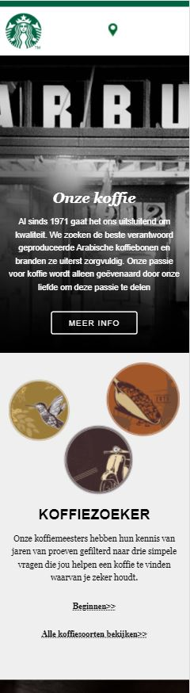
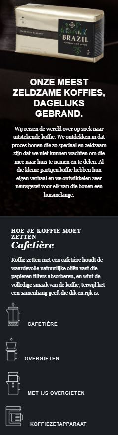
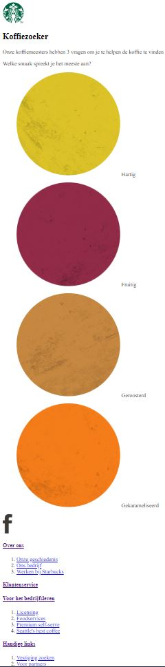
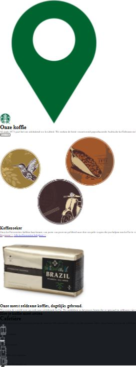
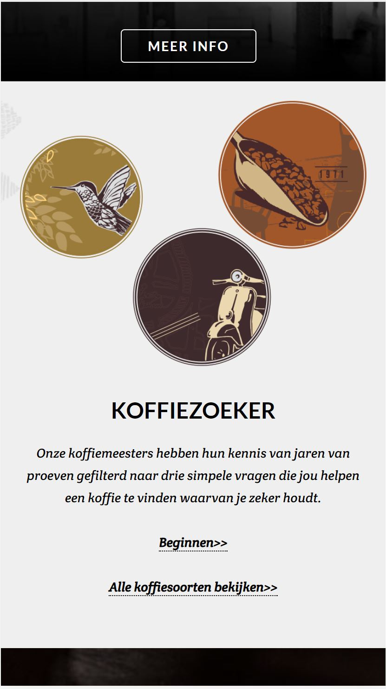
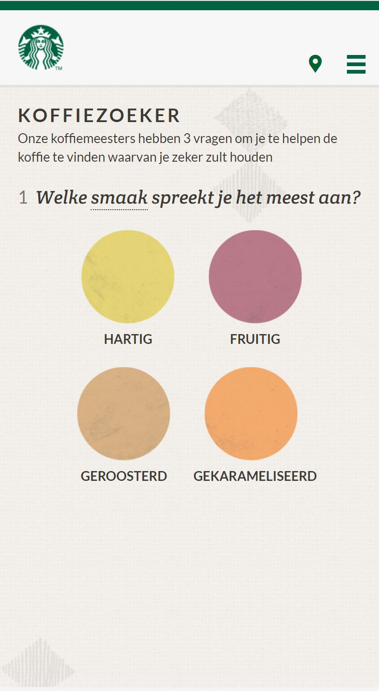
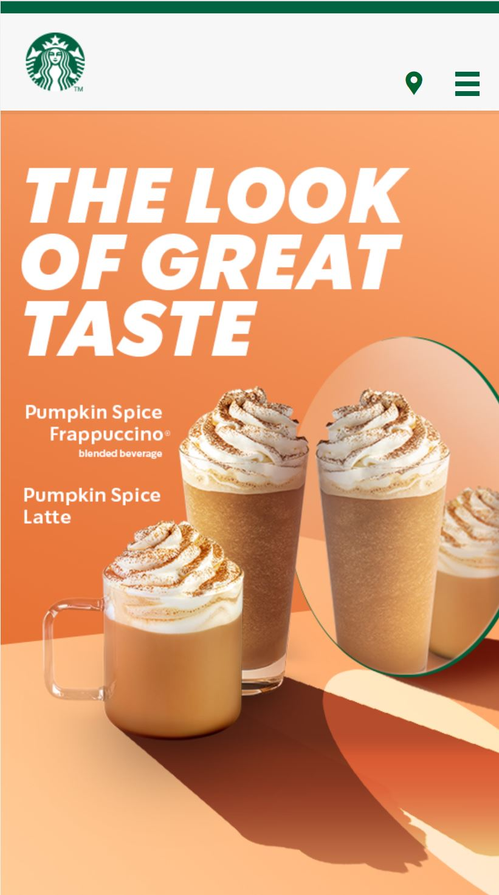
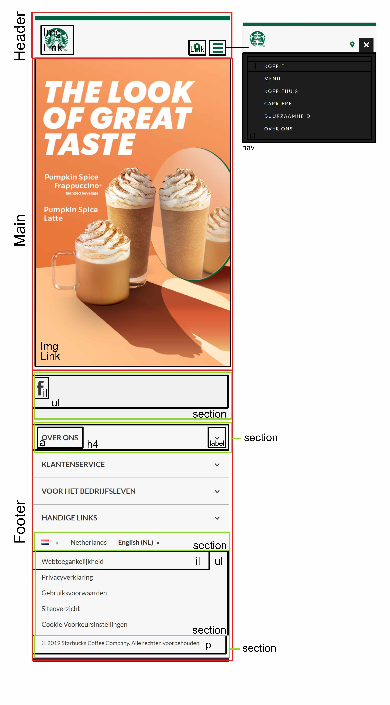

# Procesverslag
**Auteur:** Carmen Wibier
Codepen oefeningen: https://codepen.io/carmenwibier/pens/

Markdown cheat cheet: [Hulp bij het schrijven van Markdown](https://github.com/adam-p/markdown-here/wiki/Markdown-Cheatsheet). Nb. de standaardstructuur en de spartaanse opmaak zijn helemaal prima. Het gaat om de inhoud van je procesverslag. Besteedt de tijd voor pracht en praal aan je website.

## Bronnenlijst
1. -bron 1-
2. -bron 2-
3. -...-

## Eindgesprek (week 7/8)

-dit ging goed & dit was lastig-

**Screenshot(s):**

-screenshot(s) van je eindresultaat-

## Voortgang 3 (week 6)

-same as voortgang 1-

## Voortgang 2 (week 5)

### Stand van zaken
Ik heb aan de css gewerk voor de index pagina. Doordat ik verschillende onderwerpen van het huiswerk kon toepassen heb ik dit zonder te veel tegenslag kunnen doen.

**Screenshot(s):**

### Agenda voor meeting

>Planning voor aankomende weken:

1. Na het feedback gesprek verder met de 2e pagina css en beginnen met javascript.
2. Vragen opstellen voor de studentenassistenten. 
3. Huiswerk van andere medestudenten bekijken voor eventuele aanvulling van eigen proces.

>Vragen: 
1. Opmaak van een link
2. Beste manier om een IMG en tekst op één zelfde lijn te krijgen.
3. Zijn er nog elementen die in de css globaler/snellere manier gescherven kunnen worden

## Voortgang 1 (week 3)

### Stand van zaken

De html ging zonder problemen, het was wel lastig om de fotos uit de source code te halen. 
Het was ook fijn om te kijken hoe de website was gebouwd en daar idee mee op te doen.

**Screenshot(s):**

### Agenda voor meeting

>Planning voor aankomende weken:

1. De dag na de les 19 septemeber 2020 begin maken met CSS.
2. Vragen opstellen voor de studentenassistenten. 
3. Kijken of we al iets met Javascript kunnen doen?
4. Huiswerk van andere medestudenten bekijken voor eventuele aanvulling van eigen proces.

Vragen: 
1. Div, wanneer wel en wanneer niet. 
2. Hoe moet je een hamburgermenu maken
3. Hamburger menu, logo en nog een item in nav bar, die wel in een <ul> of niet?
4. Mobile version eerste 4 items zichtbaar en de rest valt onder meer en op desktop versie zie je alle onderwerpen in de nav bar. Hoe codeer je dit?
5. Positionering (Akshay)
6. Logo in header staat niet in het midden (Karlijn)

### Verslag van meeting

-na afloop snel uitkomsten vastleggen-

## Intake (week 1)

**Je startniveau:** -rood-

**Je focus:** -surface plane-

**Je opdracht:** [Starbucks](https://www.starbucks.nl/)

**Screenshot(s):**

   

**Breakdown-schets(en):**

